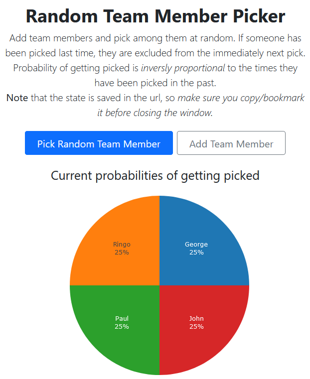

# Random Team Member Picker

A simple random item picker that is able to read and set historical pick information in the url.

# Get started

Simply go to [this url](https://htmlpreview.github.io/?https://github.com/gabrielecalvo/random-picker/blob/main/index.html) and setup your items to pick from.

After that, you can simply save the url wherever you want and that will store the state:

- last picked
- number of times each item was picked

# Example

See [here](https://htmlpreview.github.io/?https://github.com/gabrielecalvo/random-picker/blob/main/index.html?last=null&items=George%3A2%2CRingo%3A2%2CPaul%3A2%2CJohn%3A2) for a pre-filled example with 4 team members.
